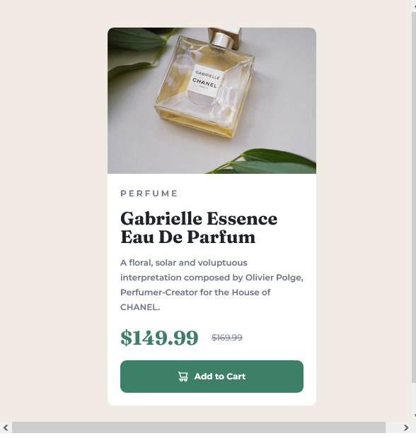

# Frontend Mentor - Product preview card component solution

This is a solution to the [Product preview card component challenge on Frontend Mentor](https://www.frontendmentor.io/challenges/product-preview-card-component-GO7UmttRfa).

## Table of contents

- [Overview](#overview)
  - [The challenge](#the-challenge)
  - [Screenshot](#screenshot)
  - [Links](#links)
- [My process](#my-process)
  - [Built with](#built-with)
  - [What I learned](#what-i-learned)
  - [Continued development](#continued-development)
  - [Useful resources](#useful-resources)
- [Author](#author)


## Overview

- I have used Tailwind CSS to design the component, which is used to display the product in desktop and mobile view.

### The challenge

Users should be able to:

- See hover and focus states for all interactive elements on the page,
- view the product in both mobile and desktop,

### Screenshot




### Links

- Solution URL: [Look the solution here](https://github.com/DhahiraThesneem/frontEnd-Mentor/tree/master/social-links-profile-main_tailwind)
- Live Site URL: [Look my live site here](https://your-live-site-url.com)

## My process

### Built with

- Semantic HTML5 markup
- [Tailwind CSS](https://tailwindcss.com/) - Tailwind CSS 
- Flexbox
- Mobile-first workflow
- Responsible Design

### What I learned

- I have understood how to customized line-height in Tailwind CSS 

```html
<script>
    tailwind.config = {
      theme: {
        extend: {
          lineHeight: {
            'extra-tight': '1',
            '4': '1rem',
            'relaxed-cus' : '1.75',
            '12': '3rem,'
          }
        }
      }
    }
  </script>
```

### Continued development

- In this project, I have directly applied Tailwind CSS from scratch. In future project, I want to use Javascript.

### Useful resources

- [Example resource 1](https://tailwindcss.com/) - This helped me for learing Tailwind CSS.


## Author

- Frontend Mentor - [@DhahiraThesneem](https://www.frontendmentor.io/profile/DhahiraThesneem)
